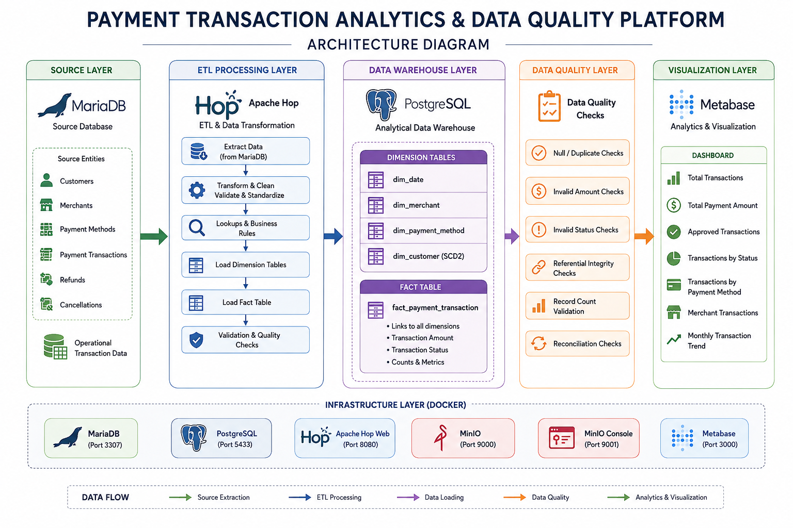

# Payment Transaction Analytics & Data Quality Platform

A containerized end-to-end data engineering project that implements a payment transaction analytics platform using **MariaDB, Apache Hop, PostgreSQL, Docker, and Metabase**.

The project demonstrates source-to-warehouse ETL, dimensional modelling, fact and dimension tables, data quality validation, and business analytics through an interactive dashboard.

---

## Architecture



The platform follows this end-to-end data flow:
````markdown

MariaDB / Source Database
        |
        v
   Apache Hop
 ETL + Transformation
        |
        v
PostgreSQL Data Warehouse
        |
        v
 Data Quality Validation
        |
        v
     Metabase
Analytics Dashboard
````

---

## Technology Stack

| Local Component | Purpose                                        |
| --------------- | ---------------------------------------------- |
| MariaDB         | Source / OLTP database                         |
| Apache Hop      | ETL and data transformation                    |
| PostgreSQL      | Analytical data warehouse                      |
| Docker Compose  | Containerized service environment              |
| Metabase        | Business analytics and visualization           |
| SQL             | Data extraction, transformation and validation |
| Python          | Supporting data generation / utility scripts   |
| Git             | Version control                                |
| GitHub          | Source code repository                         |

---

## What I Implemented

### Warehouse Modeling

The project uses a dimensional modelling approach for analytical reporting.

Implemented warehouse components include:

* `dim_date` pipeline
* `dim_merchant` pipeline
* `dim_payment_method` pipeline
* `dim_customer` dimension
* `fact_payment_transaction` fact table

The fact table uses dimension keys to support analytical queries across customers, merchants, payment methods and dates.

---

### ETL with Apache Hop

Apache Hop is used as the ETL layer between the MariaDB source database and the PostgreSQL data warehouse.

The ETL flow performs:

```text
Source Extraction
       ↓
Data Transformation
       ↓
Lookup / Dimension Mapping
       ↓
Fact and Dimension Loading
       ↓
PostgreSQL Data Warehouse
```

The project includes Apache Hop pipeline definitions under:

```text
hop-project/
├── pipelines/
└── workflows/
```

The implemented pipeline assets include:

```text
dim_date.hpl
dim_merchant.hpl
dim_payment_method.hpl
```

The project also documents additional pipeline and workflow components for the payment transaction processing flow.

---

## Data Warehouse

PostgreSQL is used as the analytical warehouse.

The warehouse follows a star-schema style design.

```text
                    dim_date
                       |
                       |
                       v
dim_customer ---> fact_payment_transaction <--- dim_merchant
                       ^
                       |
                       |
                dim_payment_method
```

### Dimension Tables

#### `dim_date`

Stores date-related attributes used for time-based reporting and monthly transaction analysis.

#### `dim_merchant`

Stores merchant-related attributes used for merchant-level transaction analysis.

#### `dim_payment_method`

Stores payment method attributes such as method code, method group and active status.

#### `dim_customer`

Stores customer information used for customer-level transaction analysis.

---

## Fact Table

### `fact_payment_transaction`

The fact table stores payment transaction records and analytical measures.

It contains transaction information and references the related dimension records through dimension keys.

The fact table supports:

* Transaction count analysis
* Payment amount analysis
* Transaction status analysis
* Merchant analysis
* Payment method analysis
* Monthly trend analysis

The validated fact table contains:

```text
998 payment transactions
```

---

## Data Quality and Validation

Data quality checks were performed against the payment transaction fact table before using the data for analytics.

The validation checks include:

* Null transaction ID validation
* Duplicate transaction ID validation
* Invalid transaction amount validation
* Invalid transaction status validation
* Customer dimension key validation
* Merchant dimension key validation
* Payment method dimension key validation
* Transaction count reconciliation

### Data Quality Rules

#### Transaction ID

Transaction IDs must not be NULL.

#### Duplicate Transactions

Transaction IDs should not appear more than once.

#### Transaction Amount

Transaction amount must not be NULL or negative.

#### Transaction Status

Valid transaction statuses are:

```text
APPROVED
DECLINED
PENDING
```

#### Dimension Keys

Fact records should contain valid:

```text
customer_key
merchant_key
payment_method_key
```

---

## Validation Performed

The final warehouse data was validated using SQL queries and Metabase analytics.

### Transaction Count

```text
Total Transactions = 998
```

### Transaction Status Reconciliation

| Status    | Transactions |
| --------- | -----------: |
| APPROVED  |          657 |
| DECLINED  |          167 |
| PENDING   |          174 |
| **TOTAL** |      **998** |

The transaction status values reconcile with the total transaction count:

```text
657 + 167 + 174 = 998
```

### Payment Amount

```text
Total Payment Amount = 1,239,511.79
```

---

## Data Quality Dashboard

A dedicated Metabase dashboard was created to monitor the quality of the payment transaction warehouse.

### Payment Transaction Data Quality Dashboard

The dashboard contains validation cards for:

* Total Transactions
* Null Transaction IDs
* Duplicate Transaction IDs
* Invalid Amounts
* Invalid Status
* Missing Customer Keys
* Missing Merchant Keys
* Missing Payment Method Keys

The dashboard provides a quick view of whether the warehouse data is ready for analytical reporting.


---

## Business Analytics Dashboard

The project includes a Metabase dashboard for payment transaction analytics.

### Payment Transaction Analytics Dashboard

The dashboard contains:

* Total Transactions
* Approved Transactions
* Total Payment Amount
* Transactions by Status
* Transactions by Payment Method
* Merchant Transactions
* Monthly Transaction Trend


---

## Business Metrics

The current analytics dataset contains:

| Metric                |        Value |
| --------------------- | -----------: |
| Total Transactions    |          998 |
| Approved Transactions |          657 |
| Declined Transactions |          167 |
| Pending Transactions  |          174 |
| Total Payment Amount  | 1,239,511.79 |

---

## Transaction Status Analysis

The transaction status distribution is:

```text
APPROVED  → 657
DECLINED  → 167
PENDING   → 174
```

This allows the business to understand successful, declined and pending payment activity.

---

## Payment Method Analysis

The payment method transaction distribution is:

| Payment Method Key | Transactions |
| -----------------: | -----------: |
|                  2 |          156 |
|                  3 |          167 |
|                  4 |          163 |
|                  5 |          162 |
|                  6 |          159 |
|                  7 |          191 |
|          **Total** |      **998** |

---

## Merchant Analysis

The dashboard provides transaction-level analysis by merchant.

Merchant transaction analysis can be used to identify:

* High transaction-volume merchants
* Low transaction-volume merchants
* Distribution of payment activity across merchants

---

## Monthly Transaction Trend

The analytics dashboard provides a monthly transaction trend.

The monthly view makes it easier to understand how payment transaction activity changes over time.

The visualization is grouped by month for business reporting.

---

## Project Structure

```text
payment-transaction-analytics-dq/
│
├── datasets/
│   ├── generated/
│   │   ├── cancellations.csv
│   │   ├── customers.csv
│   │   ├── merchants.csv
│   │   ├── payment_methods.csv
│   │   ├── payment_transactions.csv
│   │   └── refunds.csv
│   └── README.md
│
├── docs/
│   ├── MACBOOK_TOP_LEVEL_GUIDE.md
│   ├── architecture.png
│   ├── Payment Transaction Analytics Dashboard.png
│   └── Payment Transaction Data Quality Dashboard.png
│
├── drivers/
│   ├── postgresql-42.7.11.jar
│   └── README.md
│
├── hop-project/
│   ├── pipelines/
│   │   ├── BUILD_THESE_IN_HOP.txt
│   │   ├── dim_date.hpl
│   │   ├── dim_merchant.hpl
│   │   └── dim_payment_method.hpl
│   │
│   ├── workflows/
│   │   └── BUILD_THESE_IN_HOP.txt
│   │
│   └── README.md
│
├── scripts/
│   ├── generate_payment_data.py
│   ├── mariadb_validation.sql
│   ├── postgres_validation.sql
│   └── reconciliation_queries.sql
│
├── sql/
│   ├── mariadb/
│   │   └── 01-source-schema.sql
│   │
│   └── postgres/
│       ├── 00-create-bi-role.sh
│       ├── 01-warehouse-schema.sql
│       └── 99-grant-bi-role.sh
│
├── superset/
│   └── Dockerfile
│
├── docker-compose.yml
├── .gitignore
├── LICENSE
└── README.md
```

---

## Run Locally

### Clone the Repository

```bash
git clone https://github.com/kanimozhijayakumar/payment-transaction-analytics-dq.git
```

### Enter the Project

```bash
cd payment-transaction-analytics-dq
```

### Start Docker Services

```bash
docker compose up -d
```

### Check Running Containers

```bash
docker ps
```

---

## Local Services

| Service        | Port |
| -------------- | ---: |
| Apache Hop Web | 8080 |
| Metabase       | 3000 |
| PostgreSQL     | 5433 |
| MariaDB        | 3307 |
| MinIO          | 9000 |
| MinIO Console  | 9001 |

---

## Analytics Access

### Metabase

```text
http://localhost:3000
```

The Metabase instance is used to connect to the PostgreSQL warehouse and create analytics dashboards.

### Apache Hop

```text
http://localhost:8080
```

Apache Hop is used for ETL pipeline development and execution.

---

## Validation Workflow

The project follows this validation flow:

```text
MariaDB Source
      |
      v
Apache Hop ETL
      |
      v
PostgreSQL Warehouse
      |
      v
Data Quality Validation
      |
      +---- Null Checks
      |
      +---- Duplicate Checks
      |
      +---- Amount Validation
      |
      +---- Status Validation
      |
      +---- Dimension Key Validation
      |
      v
Metabase Analytics
```

---

## Project Results

The completed project demonstrates:

* Source-to-warehouse ETL
* Dimensional data modelling
* Fact and dimension design
* Payment transaction analytics
* Data quality validation
* SQL-based reconciliation
* Business dashboard development
* Containerized development environment
* Git-based version control
* GitHub project hosting

The final analytics dataset contains:

```text
998 transactions
```

with:

```text
657 Approved
167 Declined
174 Pending
```

and:

```text
1,239,511.79
```

in total payment amount.

---

## GitHub Repository

The complete source code and project files are available in the GitHub repository.

**Repository:** [payment-transaction-analytics-dq](./)

---

## Skills Demonstrated

`Data Engineering` · `ETL/ELT` · `Apache Hop` · `PostgreSQL` · `MariaDB` · `Docker` · `Metabase` · `SQL` · `Data Warehousing` · `Dimensional Modeling` · `Fact Tables` · `Dimension Tables` · `Data Quality` · `Data Validation` · `Python` · `Git` · `GitHub`

---

## Future Enhancements

The project can be extended with:

* Automated data-quality workflows
* Incremental watermark-based loading
* ETL audit logging
* Data-quality quarantine tables
* Automated failure handling
* Scheduled ETL execution
* Advanced dashboard filtering
* Additional business KPIs
* Pipeline monitoring
* Automated testing
* Cloud deployment

---

## Documentation

Project documentation is maintained inside the `docs/` directory.

Additional SQL validation scripts are available under:

```text
scripts/
```

Database schema scripts are available under:

```text
sql/
```

Apache Hop assets are available under:

```text
hop-project/
```

---

## Security

Sensitive credentials should not be committed to GitHub.

The project uses `.gitignore` rules for local environment and credential-related files.

Before sharing or deploying the project, review:

* Database passwords
* API tokens
* Environment variables
* Local configuration
* Connection credentials

---

## License

MIT License.

See the `LICENSE` file for details.
````
